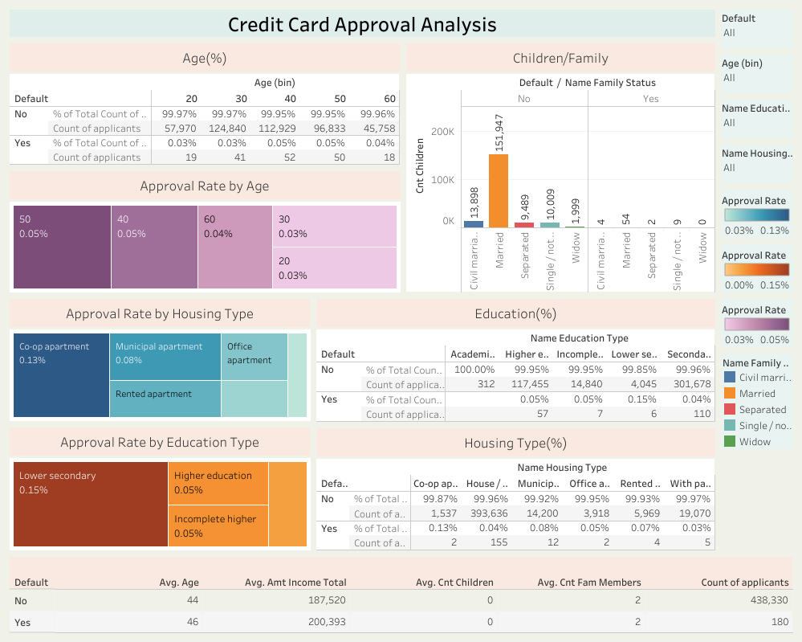

# Credit Card Approval Analysis Dashboard
## Visualization (Dashboard)
This Tableau Dashboard visualizes approval rates segmented by demographic and socioeconomic variables such as age, education, housing, income type, and family status.  Users can explore patterns through filters and comparative visualizations to better understand which groups are more likely to receive credit approval.

- For more details, please refer to the Tableau Public Dashboard [Click Here](https://public.tableau.com/views/CreditCardApprovalAnalysis_17453747124030/FrontPage?:language=en-US&:sid=&:redirect=auth&:display_count=n&:origin=viz_share_link)
## Project Overview
This project presents an interactive Tableau dashboard that explores the credit card approval process using a dataset containing 438,510 applicants. The primary objective is to provide potential credit card applicants with a data-driven understanding of the approval process by analyzing key demographic and socioeconomic variables. The dashboard is designed to help users identify trends and correlations that may impact credit card approval outcomes.
## Dataset
Please refer to [Click Here](https://drive.google.com/file/d/1-EFfYdgkc55GRVwP4DoT_N-54p-xfOPU/view?usp=sharing)
## Key Findings
- The overall approval rate is 0.04%, indicating highly selective criteria.
- Slightly higher approval rates are observed among applicants with higher education, specific housing types, and certain family compositions.
- Interactive filtering allows isolating and comparing approval performance across different demographic groups.
## Exploratory Data Analysis (EDA)
The EDA dashboard provides an overview of the dataset structure and distribution, highlighting key variables such as income, age, education, and approval outcomes.  It identifies trends, potential outliers, and demographic imbalances to support informed feature selection and guide downstream analysis.
- For more details,  please refer to the Tableau Public Dashboard [Click Here](https://public.tableau.com/views/CreditCardApprovalEDA/Story1?:language=en-US&:sid=&:redirect=auth&:display_count=n&:origin=viz_share_link)

